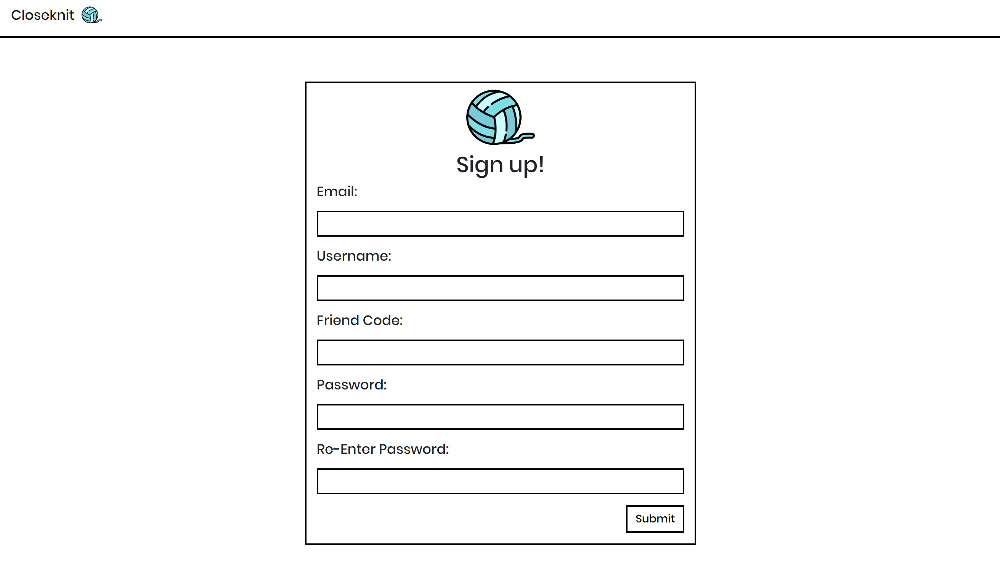
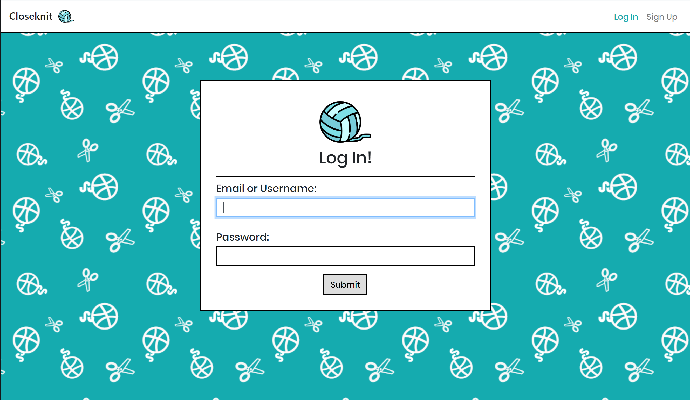
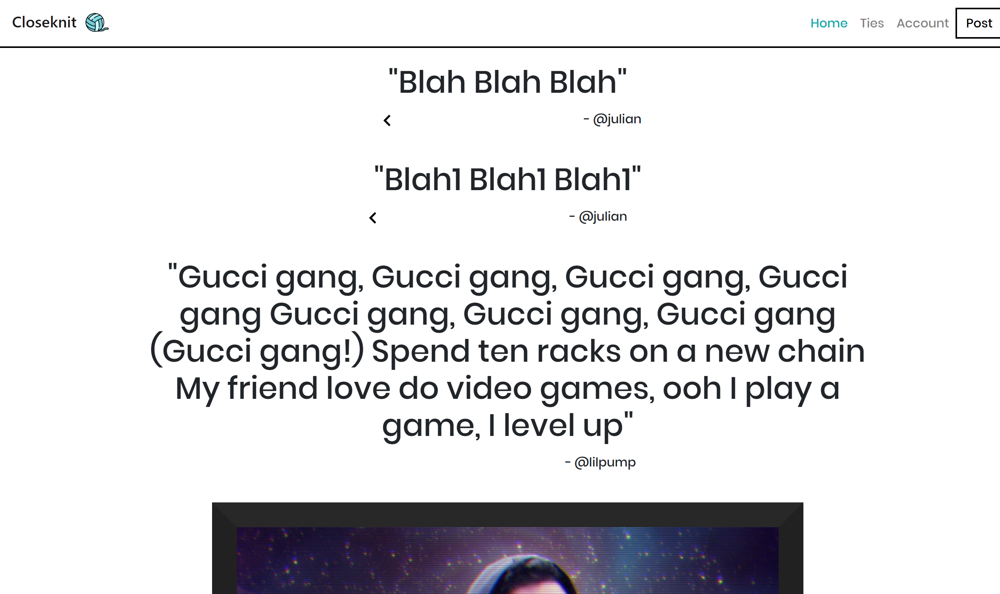
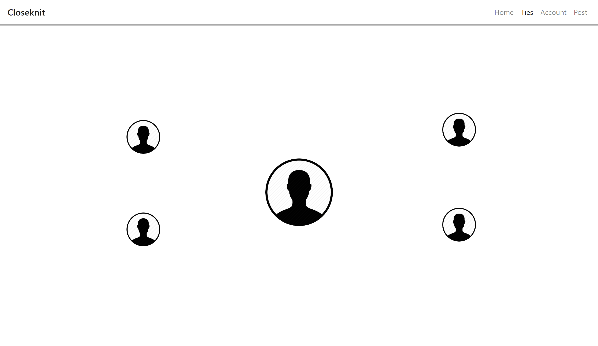
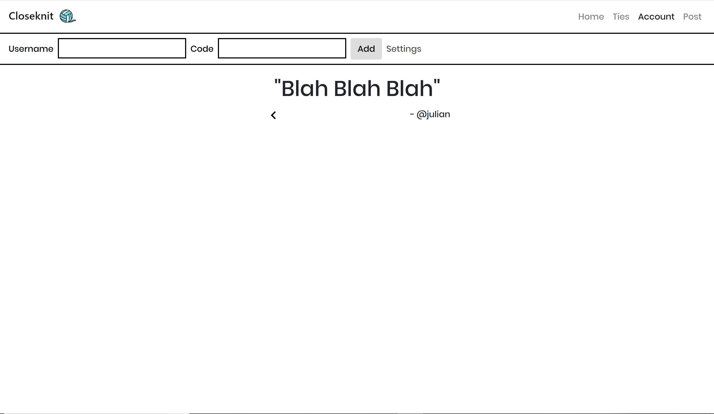

# TEAM NAME
DEEP

# WEB APPLICATION NAME
Closeknit

# Team Overview

* Sivan Myers, sivanmyers
* Vincent Pietropaolo, vpietropaolo
* Julian Killingback, jfkback
* Jordan Sheffield, jesheffie
* Gizem Cicekli, gcicekli
* Andy Lussier, alussier16

# Innovative Idea

Our team's innovative idea is to build a social network designed for personal, real life connections. Drawing from the existing social media sites Facebook and Twitter, we looked at what we felt made these sites cluttered and less personal, and went from there. The network will be designed and built in a way that only people you know in real life will be able to add you on the network, and we de-emphasize displaying the number of likes/reactions so the content people share isn't tailored for digital validation. 

We Accomplish our goal to build a smaller, more personal social network through a variety of design choices. A key feature of our platform is the use of friend codes. A friend code is like a second, private, user name, that only the account holder can see. Both a username and friendcode are required to create a new connection on our network. Therefore, for someone to add a friend on our platform, they must first have been given a user's friend code personally before they are able to send a friend request to another user.

Another core design feature of our network is limiting the number of friends for all users. Drawing from the realization that there is at any given moment, on current social networks, a handfull of people whose posts you care about, we decided the best way to keep the network personal, was to limit all users to 99 friends. This way you won't see a post from that guy or girl you met once, five years ago. Closeknit is designed for the people you know personally and whose lives you regularly follow but without the clutter of other distracting social media content you don't care about. Once capped at 99 friends, users are required to cut ties with a currect connection before they are able to add a new one. 

The final idea rounding out our platform is in redesigning how other users interact with posts. Closeknit is designed to be personal and a place where users feel comfortable to share their thoughts without being concerned if people will "like" their post. For this reason, we've removed a display of the number of likes you receive on posts and instead show a progress bar break down of the percentage of each type of reaction people made. This way, if half the people liked your post and half thought it was funny, the progress bar will display each reaction at 50-50, even if that is only a few people. Furthermore, each user is only allowed one comment per post, and you will only ever see the comments on your friend's posts made by mutual connections. This way you only see what your other friends think about a friend's post and never what some distant relative of your friend thinks about their post.

Through these design choices, we believe we will accomplish what we set out to do, which is building a social network designed not for you and the vast network of strangers on the internet, but for the closeknit group of people in your life with which you have a real life connection.

# Important Data

The five types of different data we have incorporated into our project is as follows. We will have the posts itself, which can be comprised of text posts or posts with images, two different types of data in the posts. Then, as we've mentioned previously, we will have reaction/like data that users make on posts. Additionally, we will have comment data from users on posts. We will also have to maintain lists of user's ties/connections to keep track of their friends. Lastly, users will also have a profile itself that users will be able to update and maintain, that will keep a record of their post history.

# User Interface

To hammer home the idea of a decluttered social newtowrk, without all the junk, we went with a very minimalist design only including small hints of color when focused on certain elements of the page. Users will begin at the signup page where they will enter all the relevant information needed to create an account. After creating an account, users get to the site through a login page. From there, they land on the main page which displays all the new posts in their feed and where they are able to see posts and images that their connections have posted. A user's friends are called "Ties" on Closeknit and you can see all your friends displayed as bubbles around you. From here you'll be able to manage your "Ties" and also cut "Ties" if you need space for new ones. Lastly, there is an account page from which you can add new "Ties" once you have a username and corresponding friend code, and also see your post history and all the comments and reactions people have made on them.

